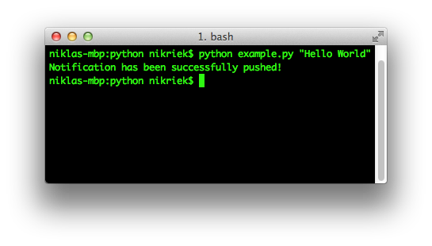

PushCo
====

PushCo is a wrapper for [Push.co](http://push.co/)'s API. For now, the class only supports ["Post notifications"](http://push.co/api/push) for a specific "Push App". 

## How to use
At first I created the wrapper in PHP. Other languages will follow.
All folders consist of two files:

* `push.EXTENSION` – Libray
* `example.EXTENSION` – Example

The code should be self-explaining.

##Example

## License
No license of course. Feel free to use it anywhere you want. But a short message is appreciated!
